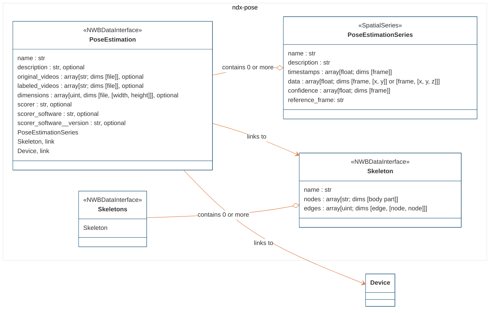
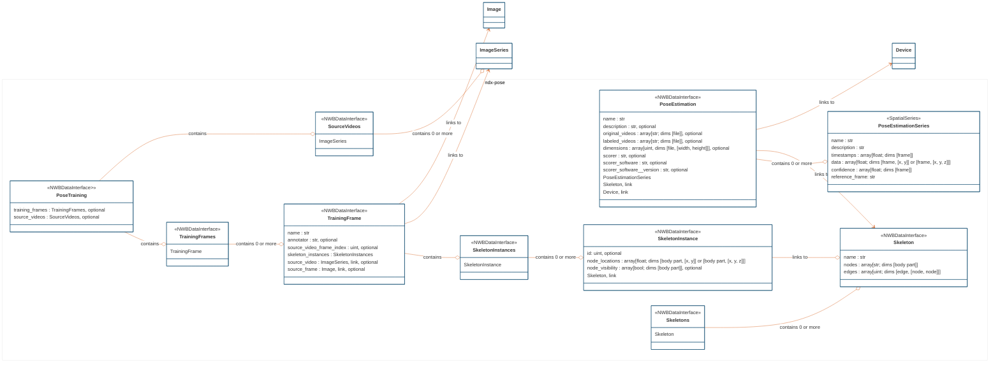

# ndx-pose Extension for NWB

ndx-pose is a standardized format for storing pose estimation data in NWB, such as from
[DeepLabCut](http://www.mackenziemathislab.org/deeplabcut) and [SLEAP](https://sleap.ai/).
Please post an issue or PR to suggest or add support for another pose estimation tool.

This extension consists of several new neurodata types:
- `Skeleton` which stores the relationship between the body parts (nodes and edges).
- `Skeletons` which is a container that stores multiple `Skeleton` objects.
- `PoseEstimationSeries` which stores the estimated positions (x, y) or (x, y, z) of a body part over time as well as
the confidence/likelihood of the estimated positions.
- `PoseEstimation` which stores the estimated position data (`PoseEstimationSeries`) for multiple body parts,
computed from the same video(s) with the same tool/algorithm.
- `SkeletonInstance` which stores the estimated positions and visibility of the body parts for a single frame.
- `TrainingFrame` which stores the ground truth data for a single frame. It contains `SkeletonInstance` objects and
references a frame of a source video (`ImageSeries`). The source videos can be stored internally as data arrays or
externally as files referenced by relative file path.
- `TrainingFrames` which is a container that stores multiple `TrainingFrame` objects.
- `SourceVideos` which is a container that stores multiple `ImageSeries` objects representing source videos used in training.
- `PoseTraining` which is a container thatstores the ground truth data (`TrainingFrames`) and source videos (`SourceVideos`)
used to train the pose estimation model.

It is recommended to place the `Skeletons`, `PoseEstimation`, and `PoseTraining` objects in an NWB processing module
named "behavior", as shown below.

## Installation

`pip install ndx-pose`

## Usage examples

1. [Example writing pose estimates (keypoints) to an NWB file](examples/write_pose_estimates_only.py).

2. [Example writing training data to an NWB file](examples/write_pose_training.py).

## Handling pose estimates for multiple subjects

NWB files are designed to store data from a single subject and have only one root-level `Subject` object.
As a result, ndx-pose was designed to store pose estimates from a single subject.
Pose estimates data from different subjects should be stored in separate NWB files.

Training images can involve multiple skeletons, however. These training images may be the same across subjects,
and therefore the same across NWB files. These training images should be duplicated between files, until
multi-subject support is added to NWB and ndx-pose. See https://github.com/rly/ndx-pose/pull/3

## Resources

Utilities to convert DLC output to/from NWB: https://github.com/DeepLabCut/DLC2NWB
- For multi-animal projects, one NWB file is created per animal. The NWB file contains only a `PoseEstimation` object
  under `/processing/behavior`. That `PoseEstimation` object contains `PoseEstimationSeries` objects, one for each
  body part, and general metadata about the pose estimation process, skeleton, and videos. The
  `PoseEstimationSeries` objects contain the estimated positions for that body part for a particular animal.

Utilities to convert SLEAP pose tracking data to/from NWB: https://github.com/talmolab/sleap-io
- Used by SLEAP (sleap.io.dataset.Labels.export_nwb)
- See also https://github.com/talmolab/sleap/blob/develop/sleap/io/format/ndx_pose.py

Keypoint MoSeq: https://github.com/dattalab/keypoint-moseq
- Supports read of `PoseEstimation` objects from NWB files.

NeuroConv: https://neuroconv.readthedocs.io/en/main/conversion_examples_gallery/conversion_example_gallery.html#behavior
- NeuroConv supports converting data from DeepLabCut (using `dlc2nwb` described above),
  SLEAP (using `sleap_io` described above), FicTrac, and LightningPose to NWB. It supports appending pose estimation data to an existing NWB file.

Ethome: Tools for machine learning of animal behavior: https://github.com/benlansdell/ethome
- Supports read of `PoseEstimation` objects from NWB files.

Related work:
- https://github.com/ndx-complex-behavior
- https://github.com/datajoint/element-deeplabcut

Several NWB datasets use ndx-pose 0.1.1:
- [A detailed behavioral, videographic, and neural dataset on object recognition in mice](https://dandiarchive.org/dandiset/000231)
- [IBL Brain Wide Map](https://dandiarchive.org/dandiset/000409)

Several [open-source conversion scripts on GitHub](https://github.com/search?q=ndx-pose&type=code&p=1)
also use ndx-pose.

## Diagram of non-training-related types

## Diagram of all types

## Contributors
- @rly
- @bendichter
- @AlexEMG
- @roomrys
- @CBroz1
- @h-mayorquin
- @talmo
- @eberrigan

This extension was created using [ndx-template](https://github.com/nwb-extensions/ndx-template).
